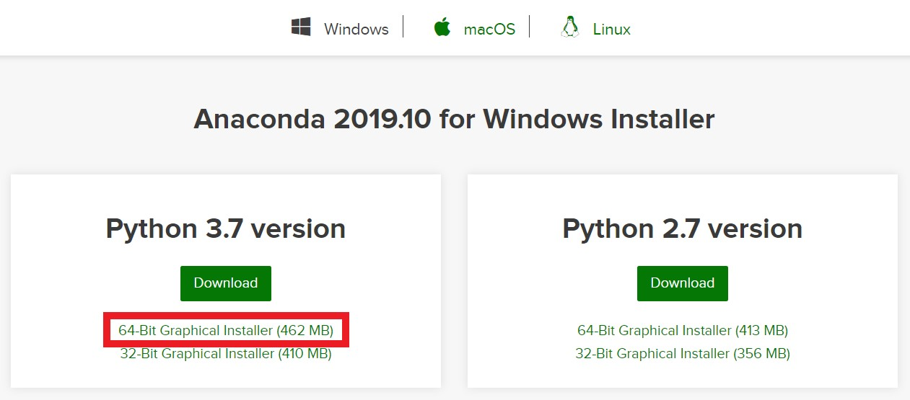

# Kiwoom API를 이용한 알고리즘 트레이딩 환경설정(Windows)

본문은 https://wikidocs.net/book/110 (파이썬으로 배우는 알고리즘 트레이딩 (개정판-2쇄))를 따라하면서 삽질한 결과를 바탕으로 쓰여졌다.

<hr/>

- 목차
  * [1. open API 및 koa studio 설치](#1-open-api-및-koa-studio-설치)
  * [2. anaconda 설치](#2-anaconda-설치)
  * [3. 필요한 package 설치(jupyter notebook)](#3-필요한-package-설치(jupyter-notebook))

<hr/>

## 1. open api 및 koa studio 설치
위 과정은 티스토리 글의 개발환경 구축작업의 1~3번 까지의 과정과 동일하므로 아래의 링크를 참고하면 될 것이다.

> https://toptrader.tistory.com/9

## 2. anaconda 설치

> https://www.anaconda.com/distribution/



키움 Open API 는 32bit Anaconda 환경에서 사용가능하다. [그래도 64bit Anaconda 설치할 것을 추천!]
[출처 : 키움 Open API & 텐서플로 & 케라스 동시 사용|작성자 bycho211](http://blog.naver.com/PostView.nhn?blogId=bycho211&logNo=221416542989)


만약 64bit 환경에서 키움 Open API를 이용하여 Login하는 Python Script를 실행할 경우 아래의 line에서
``` Python
from PyQt5.QtWidgets import *
```
다음과 같은 에러가 발생한다.
```
Traceback (most recent call last):
    File "~/Project_n/file_n.py", line 2, in <module>
    from PyQt5.QtWidgets import *
ImportError: DLL load failed: 지정된 모듈을 찾을 수 없습니다.

Process finished with exit code 1
```
~~대부분의 경우 이 에러로 고생하다가 찾아왔을 것이다.~~

**Python 3.7 version**

처음 Anaconda를 설치하는 경우 32bit 버전을 설치할 수도 있지만 대부분의 package들의 경우 64bit를 이용한다. 따라서 64bit version을 이용할 것을 권하며 이미 64bit Anaconda를 사용하고 있으면 재설치하지말고 아래와 같은 command를 쳐 32bit의 새로운 가상환경을 만들어 주면 된다. (virtual_env_name은 자신이 쓰고 싶은 이름을 쓰면 된다.)
``` 
set CONDA_FORCE_32BIT=1
conda create -n virtual_env_name python=3.7
```
해당 가상환경을 활성화 시키려면 아래의 cmd를 치면 된다.
```
conda activate virtual_env_name
```
base 상태의 가상환경으로 돌아가고 싶으면 아래의 cmd를 치면 된다.
```
conda deactivate
```


**주의할 것은** ``` conda update --all ``` 을 할 경우 pkg를 64bit 버전으로 바꾸어 버릴 수 있으니 잘 확인하여 compatible한 pkg로 update 해야 한다.

~~만약 이미 업데이트를 완료했다면 Python을 재설치하는 것이 가장 빠른 방법이긴 하다.~~
```
conda uninstall python
conda install python==3.7
```


## 3. 필요한 package 설치(jupyter notebook)
### 모든 package들은 virtual_env_name이 활성화된 상태에서 설치가 진행된다.

```
conda install pip
# pip을 설치한다.

pip install PyQt5
# PyQt5 pkg 설치

pip install pandas-datareader
# pandas-datareader pkg 설치 conda를 이용하면 64bit로 깔려 pip을 이용하였다.

conda install jupyter 
# jupyter notebook를 설치한다.

pip install jupyter_contrib_nbextensions && jupyter contrib nbextension install 
conda install autopep8
# jupyter extension을 설치한다.(코드 자동완성 등) conda를 이용하면 64bit로 깔려 pip을 이용하였다.

pip install ipykernel 
# jupyter notebook에서 python kernel을 선택할 수 있게 해준다. 

ipython kernel install --user --name=virtual_env_name
# 가상환경의 pkg 이용할 수 있도록 해준다.
```


설치가 완료되면 아래의 cmd를 치면된다.
```
jupyter notebook
```
그러면 default로 지정된 브라우저로 연결이 되어 프롬프트의 현재 디렉토리에 있는 파일들을 확인할 수 있을 것이다. 그 뒤 New 버튼을 눌러 kernel을 선택한 후 .ipynb 파일을 만들어 사용하면 된다.


jupyter notebook kernel 연결은 https://anbasile.github.io/programming/2017/06/25/jupyter-venv/ 링크를 참고했으며, jupyter extension 설치는 https://towardsdatascience.com/jupyter-notebook-extensions-517fa69d2231 링크를 참고했다. 링크를 타고 들어가서 자신에게 맞는 extension을 이용하면 좋을 것이다. 

Extension 설치 및 적용 부분을 친절하게 번역해주신 분도 계신다. https://junpyopark.github.io/Jupyter_Extension/

이후에는 테마 적용으로 자신의 기호를 찾아가는 것도 방법이다.